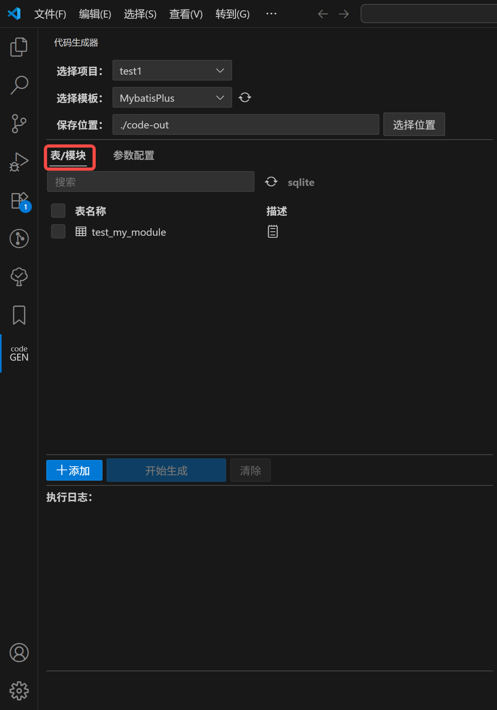

# code generator

Visual Studio Code 代码生成器插件（地址：[code generator dusk](https://marketplace.visualstudio.com/items?itemName=clovinr.code-generator-dusk)）。

- github：[https://github.com/CLovinr/code-generator](https://github.com/CLovinr/code-generator)
- gitee：[https://gitee.com/CLovinr/code-generator](https://gitee.com/CLovinr/code-generator)

## 1、安装要求

- Visual Studio Code v1.90.0+

## 2、效果展示





## 3、测试情况

1. 已测试系统
   - Windows 10，Windows 11
   - Ubuntu 22
2. 已测试数据库
   - `mysql`：5.7，8.0
   - `postgresql`：17
   - `mssql`：2012，2017，2019，2022
   - `sqlite`：v3
   - `mariadb`：11.8.2

## 4、代码生成器说明

### 基础说明

1. 文件后缀为`.jstpl`或（`.jsin`，可导入文件），模板格式类似`jsp`，只是脚本语言为`js`。
   
2. `common/scripts`中的文件为全局可调用的 js 脚本
   1. 脚本文件名必须为合法的 js 变量名
   2. 脚本文件名不要与系统内置成员重名
   3. 全局对象为`global`，类似浏览器的`window`
   4. 使用`module.exports`导出内部成员
      ```JavaScript
      module.export = {
          ...
      }
      ```

### 模板说明

1. 全局设置板块
   ```JavaScript
   <%@
       //设置输出文件
       out="java/${basePackagePath}/dto/${subName}/${moduleName}DTO.java"
   %>
   ```
   1. 格式：
      `${expression}`：变量引用（不支持表达式），支持多级，如：`${formState.var1}`，`${ formState.var1 && formState.var1 }`
   2. 支持的设置类型：
      1. `out`：设置文件输出路径字符串，支持`${varName}`格式的变量。
      2. `write`：设置是否输出文件，若最终值为`"no"`、`"false"`、`false`、`"0"`、`0`时，则不会输出文件
      3. `execute` 设置是否执行 js 脚本，若最终值为`"no"`、`"false"`、`false`、`"0"`、`0`时，则不会执行
      4. `include`：引入子模板（`*.jsin`），优先在所选模板目录的 `includes` 下查找，若未找到、则在 `common/includes` 目录下查找
      5. 忽略后面的第一个行
2. 局部脚本区域
   ```JavaScript
   <%
       let varName = "World"
   %>
   Hello <%=varName%>
   ```
   1. 在当前模板下声明的变量，仅在当前模板下有效
   2. 忽略后面的第一个行
3. 表达式输出
   ```JavaScript
   <%=expression%>
   ```
   1. 直接输出表达式结果
   2. 忽略后面的第一个行，在后面添加`!`可保留后续的第一个换行，如：`<%=currentDatetime!%>`
4. 特殊变量
   1. `out` 用于输出内容
      - `out.print(...)` 直接输出内容
      - `out.println(...)` 结尾带换行符输出内容
   2. `tableInfo`结构
      ```typescript
      {
        name: string;
        comment: string | null;
        columns: Array<{
          type: string;
          allowNull: boolean;
          defaultValue: string;
          primaryKey: boolean;
          autoIncrement: boolean;
          comment: string | null;
        }>;
      }
      ```
5. 配置文件`main.json5`
   1. `databases`用于设置数据库连接信息
   2. `attrs`设置全局变量，可在模板脚本中直接访问变量
   ```json5
   {
     attrs: {
       subName: "sub",
     },
   }
   ```
   3. `ui` 可添加自定义参数输入组件

### 数据库配置

```json5
{
  databases: {
    current: "local-mysql",
    items: {
      "local-mysql": {
        type: "mysql",
        enable: true,
        initSqls: ["SET NAMES utf8mb4"],
        options: {
          host: "localhost",
          port: 3306,
          username: "user",
          password: "password",
          database: "demo",
          ssl: false,
          dialectOptions: {
            // https://github.com/sidorares/node-mysql2
            insecureAuth: false,
          },
        },
      },
      "local-mariadb": {
        type: "mariadb",
        enable: true,
        initSqls: ["SET NAMES utf8mb4"],
        options: {
          host: "localhost",
          port: 4306,
          username: "user",
          password: "password",
          database: "demo",
          ssl: false,
          dialectOptions: {
            insecureAuth: false,
          },
        },
      },
      "local-pg": {
        type: "postgres",
        enable: true,
        initSqls: [],
        options: {
          host: "localhost",
          port: 5432,
          username: "postgres",
          password: "12345678",
          database: "postgres",
          schema: "public",
          ssl: false,
        },
      },
      "local-mssql": {
        type: "mssql",
        enable: true,
        initSqls: [],
        options: {
          host: "localhost",
          port: 1433,
          username: "sa",
          password: "123456",
          database: "demo",
          schema: "dbo",
          ssl: false,
          dialectOptions: {
            options: {
              trustServerCertificate: true,
              encrypt: false,
            },
            authentication: {},
          },
        },
      },
      "local-sqlite": {
        type: "sqlite",
        enable: true,
        initSqls: [],
        options: {
          storage: "./sample-files/test-sqlite3.db",
        },
      },
    },
  },
}
```

- `current`：当前使用的数据库
- `items`：数据库配置项
  - `type`：数据库类型，目前仅支持：`mysql`, `postgres`, `mariadb`, `mssql`, `sqlite`
  - `enable`：是否启用，当为 false 时，则不会访问数据库获取数据表
  - `initSqls`：连接成功后，初始执行的 sql 语句
  - `options`：数据库连接配置信息

### 自定义参数输入

```json5
{
  ui: {
    attr: "formState",
    params: [
      {
        var: "prop1",
        label: "参数1",
        type: "checkbox",
        forTemplates: ["MybatisPlus"],
        default: {},
        required: false,
        options: [
          { text: "Entity", value: "entity", title: "" },
          { text: "Controller", value: "controller", title: "" },
        ],
      },
      {
        var: "prop2",
        label: "参数2",
        type: "dropdown",
        default: "",
        required: false,
        options: [
          { text: "Entity", value: "entity", title: "" },
          { text: "Controller", value: "controller", title: "" },
        ],
      },
      {
        var: "prop3",
        label: "参数3",
        type: "textfield",
        default: "",
        required: false,
        maxlength: 128,
        title: "",
      },
      {
        var: "prop4",
        label: "参数4",
        type: "textarea",
        default: "",
        required: false,
        maxlength: 512,
        title: "",
      },
    ],
  },
}
```

- `ui.attr`：全局引用的变量，如：formState
- `ui.params[]`：声明输入组件
  - `var`：变量名
  - `label`：输入项标签
  - `type`：组件类型
    - 复选框（`checkbox`）：被勾选的选项值为 true，如：`Entity`被勾选时，`formState.prop1.entity===true`
      - `options`：选项数据
      - `options[].title`：鼠标放置后，选项提示内容
    - 下拉框（`dropdown`）：变量为选择选项的值，如：`formState.prop2==='controller'`
      - `options`：选项数据
      - `options[].title`：鼠标放置后，选项提示内容
    - 单行输入（`textfield`）：变量为输入值
      - `maxlength`：最大输入字符数
    - 多行输入（`textarea`）：变量为输入值
      - `maxlength`：最大输入字符数
  - `forTemplates` 可设置对哪些模板生效
  - `default`：默认值
  - `required`：是否必填项
  - `title`：鼠标放置后显示的提示内容

## 5、已知问题

## 6、发布说明

### 1.0.3（未发布）

- 显示代码生成输出文件数量信息。
- 打包发布时，自动将`README.md`文件中的图片连接改为`https://cdn.jsdelivr.net/gh/`前缀，以便中国大陆可以正常访问。
- 完善全局设置板块，`${expression}`支持表达式，如：`out = "${formState.var1 && formState.var2}"`。
- 添加的模块可上下移动排序。
- 删除添加的模块时，弹出确认框。
- 搜索可过滤添加的模块，且搜索忽略大小写。
- 可折叠日志板块。

### 1.0.2

- 较全面测试数据库：mysql、mariadb、postgres、mssql、sqlite
  - `mysql`：5.7，8.0
  - `postgresql`：17
  - `mssql`：2012，2017，2019，2022
  - `sqlite`：v3
  - `mariadb`：11.8.2
- 修复模板文件存在`\r\n`导致换行出现问题的问题
- 执行代码生成时，返回结果为空导致报错的问题

### 1.0.0

- 支持数据库：mysql、mariadb（未测试）、postgres、mssql、sqlite
- 支持批量生成
- 以 js 为脚本语言
- 模板格式类似`jsp`
- 支持自定义脚本（`common/scripts/*`）
- 支持简单的输入组件(`ui`)
- 可添加非数据库模块（暂不支持添加字段）
